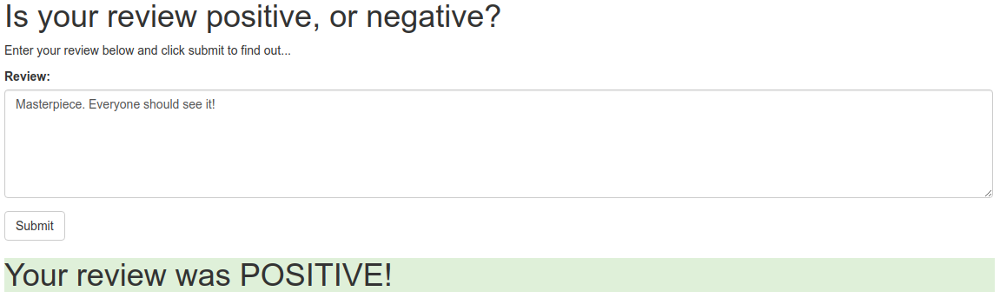

# Deploying a Model Using Amazon SageMaker

I create a simple neural network that predicts whether a movie review is positive or not. Then I deploy it as a web app so anyone can use it.

### Overview

The model is a plain RNN with one LSTM layer. I train it on movie reviews data to predict their sentiment (positive or negative). Before, I vectorize each of them with a bag-of-words model. It is just a dictionary mapping 5000 most frequent words into ints.

When the model is ready, I deploy it to an endpoint using Amazon SageMaker. Then, I set up AWS Lambda that uses this endpoint to interact with the model. Finally, I set up a web page to communicate with the Lambda through a REST API.

##### App diagram

A user interacts with the app through a web page. Once he or she submits a review, it is sent to an endpoint which calls a lambda function. The lambda's job is to transform the data and ask the model for prediction. The result goes all the way back and is displayed on a web page.

### Methods

* Sentiment Analysis
* Amazon SageMaker
* AWS Lambda

### Tech

* Python
* PyTorch
* NumPy
* Pandas

### How to use

The project notebook, `sagemaker_deployment.ipynb`, is intended to be executed using SageMaker. If you just want to read it, feel free to click on it. Or just download the repo and open `sagemaker_deployment.html`.

If you want to build the web app, you will need to start with logging into the AWS console. Then, you should go to the SageMaker service and create a new notebook instance. In the creator, add this repository. It will upload repo's files to AWS.

From this point, follow the steps in the notebook. As a last step, you will need to change the endpoint's address in `index.html`. You will be able to use the app after opening this file on your computer.

## Dataset

The model is trained on [IMDb dataset](http://ai.stanford.edu/~amaas/data/sentiment/) of movie reviews. It contains 50,000 reviews in total and is split in half between training and testing sets.
